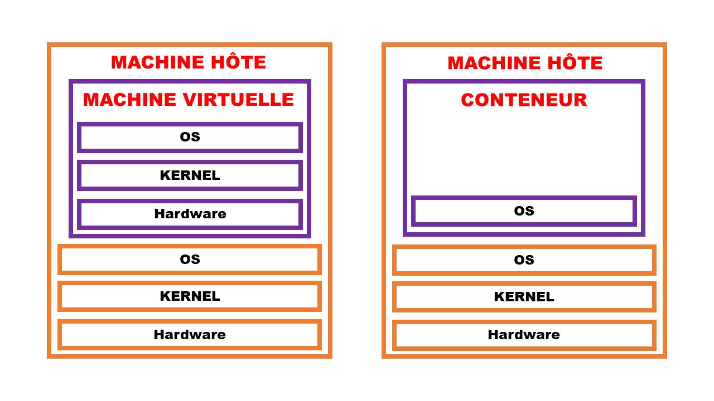
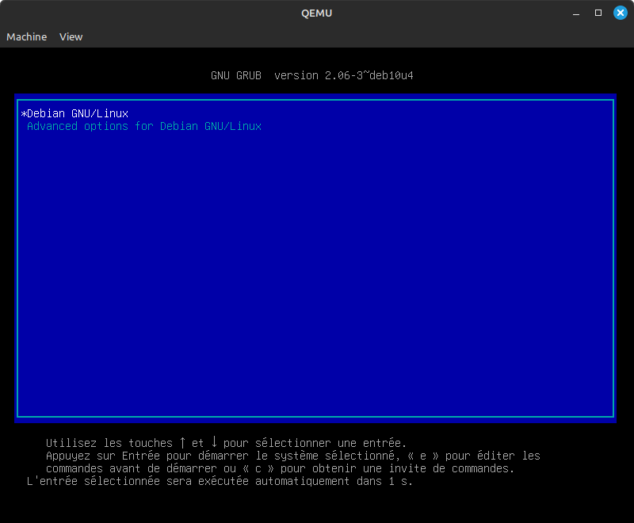
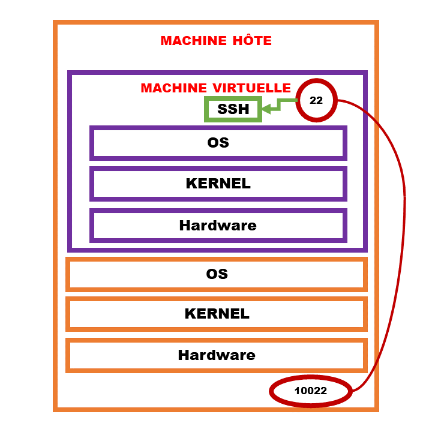
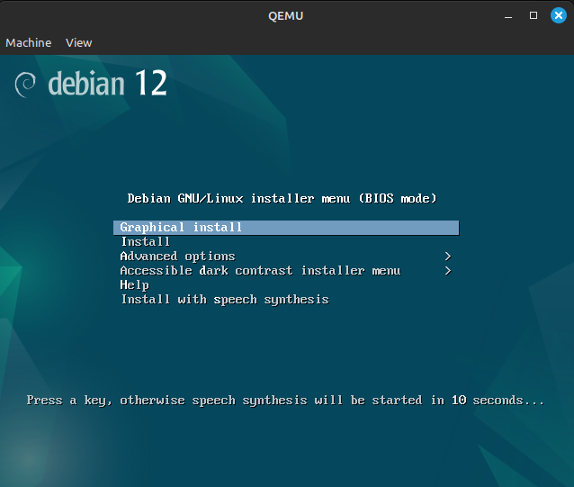
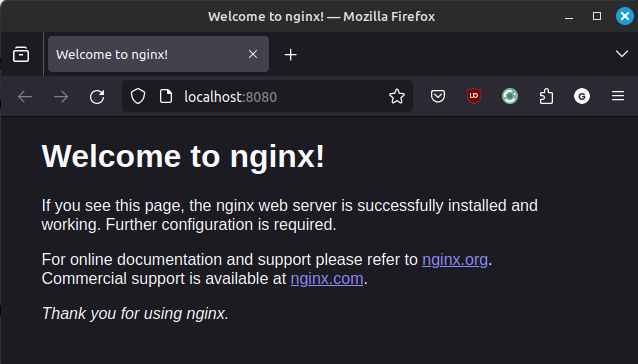
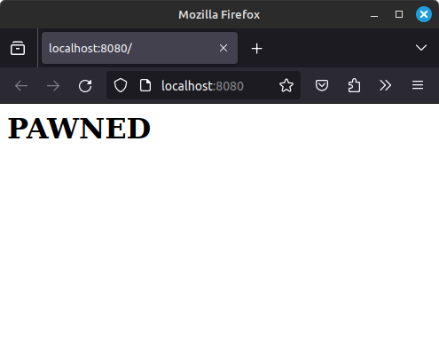

# Rapport - Julian

## # TP 3 : Docker & VMs


### <u> Exercice 1 </u>

#### &emsp; 1)

##### &emsp;&emsp;&emsp; a)

Une machine virtuelle (ou VM) est une virtualisation ou émulation d'un appareil informatique créée par un logiciel d'émulation. Le logiciel d'émulation simule la présence de ressources matérielles et logicielles telles que la mémoire, le processeur, le disque dur, voire le système d'exploitation et les pilotes, permettant d'exécuter des programmes dans les mêmes conditions que celles de la machine simulée.

##### &emsp;&emsp;&emsp; b)

Les conteneurs fournissent une isolation légère en virtualisant uniquement les couches logicielles au-dessus du système d’exploitation hôte. Ils contiennent à la fois le code de l’application et son environnement (bibliothèques, outils système, etc.) <br>
Tous les conteneurs partagent le même noyau d’OS hôte, ce qui les rend légers et efficaces. Ils peuvent s’exécuter sur n’importe quelle machine sans modification. Le démarrage et l’arrêt des conteneurs sont plus rapides que pour les VM.

##### &emsp;&emsp;&emsp; c)



##### &emsp;&emsp;&emsp; d)

**<u>Pour les VMs :</u>**
* **Avantages :**
    * <u>Isolation complète :</u> Chaque VM fonctionne de manière isolée, ce qui permet d’éviter les conflits entre applications et systèmes d’exploitation. C'est idéal pour tester des logiciels sans risquer d’endommager le système hôte.
    
    * <u>Gestion des ressources :</u> Il est possible d'allouer des ressources (CPU, mémoire, stockage) aux VM en fonction des besoins. Cela permet d’optimiser l’utilisation des ressources matérielles.

    * <u>Sauvegardes et snapshots :</u> Il est possible de créer des instantanés (snapshots) de l’état d’une VM à un moment donné. Cela facilite la restauration en cas de problème.

* **Inconvénients :**
    * <u>Lourdeur :</u> Il est nécessaire d'avoir un hyperviseur pour gérer les ressources, ce qui peut entraîner une surcharge. De plus, chaque VM inclut un système d’exploitation complet, ce qui augmente la consommation de ressources.

    * <u>Temps de démarrage :</u> Les VM prennent plus de temps à démarrer que les conteneurs. L’émulation matérielle ralentit le processus de démarrage.

    * <u>Consommation de stockage :</u> Chaque VM a besoin d’un espace de stockage dédié pour son système d’exploitation et ses application. Cela peut entraîner une utilisation inefficace de l’espace disque.

**<u>Pour les Conteneurs :</u>**

* **Avantages :**
    * <u>Accélération du développement :</u> Il est possible de travailler dans un environnement restreint, ce qui favorise la rapidité et l’efficacité. C'est une peu comme la création de bacs à sable pour tester des interactions.

    * <u>Portabilité :</u> Les conteneurs sont cohérents et peuvent s’exécuter sur différents environnements sans modification. Il y a aussi une facilité de déplacement, de copie et de redémarrage.

    * <u>Impact réduit sur les performances :</u> Les conteneurs libèrent rapidement les ressources inutilisées (mémoire, stockage).

* **Inconvénients:**
    * <u>Moins isolés que les VM :</u> Les conteneurs partagent le même noyau d’OS hôte, ce qui peut entraîner des problèmes de sécurité, contrairement au VMs qui offrent une isolation complète avec leurs propres systèmes d’exploitation.

    * <u>Dépendance aux outils d’orchestration :</u> Pour gérer efficacement les conteneurs à grande échelle, il est nécessaire d'avoir des outils d’orchestration tels que Docker. L’apprentissage et la configuration de ces outils peuvent être complexes.

##### &emsp;&emsp;&emsp;&emsp;&emsp; i)
Les VM offrent une isolation complète et sont plus sécurisées, tandis que les conteneurs sont plus légers mais nécessitent une attention particulière pour renforcer leur sécurité.

##### &emsp;&emsp;&emsp;&emsp;&emsp; ii)
Les conteneurs sont plus performants en termes de démarrage, d’utilisation des ressources et de légèreté comparé au VMs.

##### &emsp;&emsp;&emsp;&emsp;&emsp; iii)
Les VM sont recommandées pour les charges de travail lourdes nécessitant une isolation complète, tandis que les conteneurs sont parfaits pour les déploiements légers, portables et rapides.

##### &emsp;&emsp;&emsp; e)

**<u>Pour les VMs :</u>**

* <u>Développement et test d’applications :</u> Les VM permettent aux développeurs de créer des environnements isolés pour tester des applications sans affecter l’ordinateur hôte. Ils peuvent installer différents systèmes d’exploitation (Windows, Linux, etc.) sur des VM distinctes pour vérifier la compatibilité.

* <u>Environnements de production :</u> Les VM sont utilisées pour héberger des applications dans des environnements de production. Elles offrent une isolation complète, ce qui est essentiel pour les charges de travail critiques.

* <u>Migration et consolidation :</u> Les VM facilitent la migration d’applications entre différents serveurs physiques. Elles permettent également de consolider plusieurs serveurs virtuels sur un seul matériel physique, optimisant ainsi l’utilisation des ressources.


**<u>Pour les Conteneurs :</u>**

* <u>Développement et Tests :</u> Lors du développement d’une application, les conteneurs permettent aux développeurs de créer un environnement isolé pour tester leur code. Ils peuvent facilement reproduire l’environnement de production, garantissant ainsi que l’application fonctionne correctement avant le déploiement.

* <u>Déploiement et Scalabilité :</u> Les conteneurs sont idéaux pour le déploiement d’applications dans des environnements cloud ou sur site. Ils encapsulent l’application, ses bibliothèques et ses dépendances, ce qui les rend portables et faciles à déployer.

* <u>Isolation et Sécurité :</u> Les conteneurs isolent les processus et les ressources, ce qui réduit les risques de conflits entre applications. Chaque conteneur a son propre espace de noms, système de fichiers et variables d’environnement.


#### &emsp; 2)

##### &emsp;&emsp;&emsp; a)
**Faux** car une VM à besoin d'émuler un OS, mais aussi le hardware.  

##### &emsp;&emsp;&emsp; b)
**Faux** car tous les conteneurs partagent le même noyaux.

##### &emsp;&emsp;&emsp; c)
**Vrai**, c'est le but des conteneurs.

##### &emsp;&emsp;&emsp; d)
**Faux** car il est possible de lancer plusieurs VMs sur une machine physique. C'est ce que fait certain type de serveur.

##### &emsp;&emsp;&emsp; e)
**Faux** car les conteneurs utilisent le même noyaux que la machine hôte. Une VM sera plus adaptée.

##### &emsp;&emsp;&emsp; f)
**Faux**, les VM permettent d'émuler n'importe quelle architecture quelque soit celle de la machine hôte.


### <u> Exercice 2 </u>

#### &emsp; 1)
La commande `qemu-system-x86_64` ouvre une nouvelle fenêtre et donne comme message d'erreur après un certain nombre d'opérations : `No bootable device`. <br>
Cela signifie qu'il n'y a pas de dispositif sur lequel démarrer.

#### &emsp; 2)

##### &emsp;&emsp;&emsp; a)

Dans la commande `qemu-system-x86_64 -hda atoi.qcow2 -m 1024 -netdev user,id=eth0,hostfwd=tcp::10022-:22 -device e1000,netdev=eth0` :

* `-hda atoi.qcow2` : Spécifie le disque dur virtuel (ou image disque) à utiliser pour la machine virtuelle.
* `-m 1024` : Définit la quantité de mémoire RAM allouée à la machine virtuelle.
* `-netdev` : Configure un périphérique réseau virtuel.
    * `user` : Utilise un réseau virtuel de type “utilisateur” qui permet à la machine virtuelle d’accéder au réseau de l’hôte.
    * `id=eth0` : Attribue un identifiant au périphérique réseau virtuel, dans ce cas, “eth0”.
    * `hostfwd=tcp::10022-:22` : Configure une redirection de port.
* `-device` : Ajoute un contrôleur réseau virtuel à la machine virtuelle.
    * `e1000` : Utilise le modèle de contrôleur réseau virtuel Intel E1000.
    * `netdev=eth0` : Associe le contrôleur réseau virtuel au périphérique réseau virtuel “eth0”.


#### &emsp; 3)
Ce qui s'affiche est le GRUB pour lancer Debian :


#### &emsp; 4)

##### &emsp;&emsp;&emsp; a)


##### &emsp;&emsp;&emsp; b)
Sur la VM, le serveur SSH tourne sur le port `22`.

#### &emsp; 5)

##### &emsp;&emsp;&emsp; b)
On accède à la VM par le biais de SSH.


### <u> Exercice 3 </u>

#### &emsp; 1)
La commande `qemu-img create -f qcow2 mydebian.qcow2 5G` permet de créer une image vide nommé `mydebian.qcow2` de taille `5 Go`.

#### &emsp; 2)

##### &emsp;&emsp;&emsp; a)
L'erreur est dû au fait que l'image est vide, il n'y a pas de système d'exploitation d'installé dessus.

#### &emsp; 3)
Pour avoir la configuration réseau fonctionnel, il faut rajouter les paramètres suivant : <br>
`-netdev user,id=eth0,hostfwd=tcp::10022-:22 -device e1000,netdev=eth0`

#### &emsp; 5)
Il faudra rajouter la commande `-cdrom <nom_de_l'image_ISO>` pour insérer un CD, et `-boot d` pour lancer le CD directement après le démarrage de la VM. Pour lancer la VM et installer le CD sera : <br>
`qemu-system-x86_64 -m 1024 -hda ./mydebian.qcow2 -cdrom ./debian-12.5.0-amd64-netinst.iso -boot d`

#### &emsp; 6)



### <u> Exercice 4 </u>

#### &emsp; 1)

##### &emsp;&emsp;&emsp; a)
Dans le conteneur, on est l'utilisateur `root`.

##### &emsp;&emsp;&emsp; b)
Le système de fichier contient les éléments suivant : <br>
`.dockerenv`, `bin`, `boot`, `dev`, `etc`, `home`, `lib`, `lib64`, `media`, `mnt`, `opt`, `proc`, `root`, `run`, `sbin`, `srv`, `sys`, `tmp`, `usr`, `var`

##### &emsp;&emsp;&emsp; c)
Oui, il est très différent car ma machine contient beaucoup plus d'éléments.


#### &emsp; 2)

##### &emsp;&emsp;&emsp; a)
Dans la commande `docker run -ti --rm rancher/cowsay cowsay "Hello Docker"` :

* `docker run` : Créer un conteneur Docker.
* `-ti` :  Indique à Docker d’ouvrir un terminal interactif (TTY) dans le conteneur.
* `--rm` : Spécifie que le conteneur doit être supprimé automatiquement après son arrêt.
* `rancher/cowsay` : Nom de l’image Docker à utiliser pour créer le conteneur.
* `cowsay "Hello Docker"` : Commande à exécuter à l’intérieur du conteneur.


##### &emsp;&emsp;&emsp; b)
D'après **2); a)**, `rancher/cowsay` est le nom de l'image à utiliser et lancer pour créer le conteneur.

##### &emsp;&emsp;&emsp; c)
D'après **2); a)**, `cowsay "Salut Linux"` est la commande à exécuter à l'intérieur du Docker. Cette commande permet de faire dire à la vache qui s'affiche dans le terminal Docker `Salut Linux`.

##### &emsp;&emsp;&emsp; d)
Le binaire `cowsay` de trouve dans le conteneur Docker qu'on a exécuté.

##### &emsp;&emsp;&emsp; e)
En considérant que le conteneur n'est pas présent, Docker vérifie d'abord si l'image a déjà été téléchargé précédemment. Si ce n'est pas le cas, Docker télécharge l'image puis la lance dans un conteneur. 

##### &emsp;&emsp;&emsp; f)
La commande est plus rapide lors du second lancement car l'image à déjà été téléchargé pour la première fois. Cette image est stocké sur le PC pour éviter de la télécharger tout le temps.


### <u> Exercice 5 </u>

#### &emsp; 1)

##### &emsp;&emsp;&emsp; a)
Dans la commande `docker run -ti -p8080:80 nginx` :

* `docker run` : Créer un conteneur Docker.
* `-ti` :  Indique à Docker d’ouvrir un terminal interactif (TTY) dans le conteneur.
* `-p8080:80` :  Le port 80 du conteneur sera mappé vers le port 8080 de l’hôte Docker. En d’autres termes, les requêtes HTTP envoyées au port 8080 de l’hôte seront redirigées vers le port 80 du conteneur Nginx.
* `nginx` : Nom de l’image Docker à utiliser pour créer le conteneur.

##### &emsp;&emsp;&emsp; b)
On voit ceci :
 <br>
C'est la page d'accueil de nginx.

##### &emsp;&emsp;&emsp; c)
Grâce à la commande `docker ps`, on peut voir que le nom du conteneur est `dreamy_greider`.<br>
Voici le résultat que la console m'a retournée : 

```c
CONTAINER ID   IMAGE     COMMAND                  CREATED              STATUS              PORTS                                   NAMES
579fdabad382   nginx     "/docker-entrypoint.…"   About a minute ago   Up About a minute   0.0.0.0:8080->80/tcp, :::8080->80/tcp   dreamy_greider
```

##### &emsp;&emsp;&emsp; e)
D'après le fichier `default.conf`, on peut voir que le chemin de la racine du serveur WEB est `/usr/share/nginx/html`.

##### &emsp;&emsp;&emsp; f)

##### &emsp;&emsp;&emsp;&emsp;&emsp; i)
Le contenu de la page a bien changé. Voici ce qui s'affiche à présent sur `http://localhost:8080` :



#### &emsp; 2)

##### &emsp;&emsp;&emsp; a)
La commande qui était à taper est la suivante : <br>
`docker run -ti -p8080:80 -v ./ex5/html:/usr/share/nginx/html nginx`

##### &emsp;&emsp;&emsp; b)
Le mot de passe de la page secrète est `geek123`.


### <u> Exercice 6 </u>

#### &emsp; 1)

##### &emsp;&emsp;&emsp; a)
Pour lancer le serveur Redis, il faut taper la commande suivante : <br>
`docker run -ti -p6379:6379 redis`


##### &emsp;&emsp;&emsp; b)
Redis est un magasin de données clé-valeur (aussi appelé "dictionnaire" ou "table de hachage") à code source ouvert, en réseau, avec une durabilité optionnelle. Il est écrit en ANSI-C (C89).

##### &emsp;&emsp;&emsp; d)
Après avoir effectué les commandes demandés, on obtient : 

```c
SET lol 123
+OK
GET lol
$3
123
```

#### &emsp; 2)
Le script Python se trouve dans `./ex6/main.py`. <br>
L'output du programme Python sorti sur la console a été stocké dans le fichier `./ex6/occurrences.txt` grâce à la commande `python3 main.py > occurrences.txt`